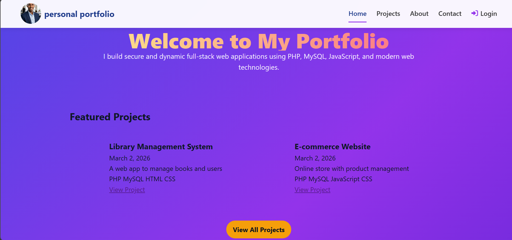

Personal Portfolio (PHP + MySQL)

Setup

1. Copy the `yoni` folder into your XAMPP `htdocs` (already under `C:/xampp5/htdocs/yoni`).
2. Import the SQL file into MySQL (phpMyAdmin or CLI):

   mysql -u root -p < C:/xampp5/htdocs/yoni/db_init.sql

3. If you use XAMPP default, DB user is `root` with empty password. Adjust `includes/db.php` if different.
4. Open http://localhost/yoni/index.php

Admin

- Visit http://localhost/yoni/admin/login.php
- If no admin exists, login with username `admin` and password `admin123` once; the admin account will be created.
- After login you can add/edit/delete projects.

Notes

- Replace the placeholder admin password hash in `db_init.sql` if you prefer to pre-create admin via SQL.
- This is a minimal scaffold. Enhance validation, file uploads, and security for production.
  
